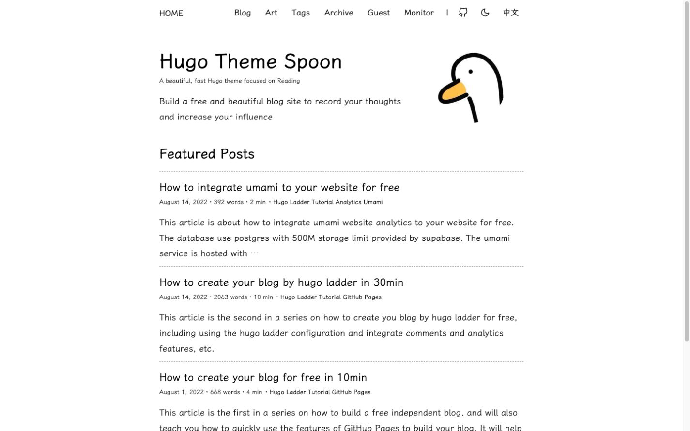
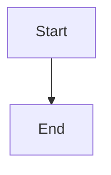

<h1 align=center>Hugo Theme Spoon</h1>

<h4 align=center>🌈 Clean | ⏩ Fast | 📰 Focus on Reading | 🌐 Multi-language | 🌙 Dark Mode | 📱 Mobile-first</h4>

<p align="center">A modern, fast, and clean Hugo theme focused on reading experience. Built with Dart Sass, supporting dark mode, multi-language, KaTeX math, Mermaid diagrams, and more.</p>

<p align="center">English | <a href="README.zh.md">简体中文</a></p>

> **Note:** This theme is forked from [hugo-theme-ladder](https://github.com/guangzhengli/hugo-theme-ladder) by [guangzhengli](https://github.com/guangzhengli), and has been heavily modified, adapted, and extended with new features to support the latest Hugo versions and modern web standards. The original theme is no longer actively maintained.

---

<p align="center">
  
</p>

---

## What's Changed from Ladder

| | hugo-theme-ladder | hugo-theme-spoon |
|---|---|---|
| Hugo Version | v0.99.0 | **v0.140.0+ extended** |
| SCSS Transpiler | libsass (deprecated) | **Dart Sass** |
| Dark Mode | Basic | **Two themes + comprehensive coverage** |
| Math Formulas | - | **KaTeX support** |
| Flowcharts | - | **Mermaid support** |
| TOC | Static | **Collapsible TOC** |
| Code Block | Basic | **Line numbers + copy button** |
| Reading Progress | - | **Progress bar** |
| Image Loading | Eager | **Lazy loading** |
| Related Posts | - | **Auto recommendations** |
| i18n | Partial | **Full i18n with more keys** |
| Code Highlight | highlight.js | **Hugo Chroma + GitHub Dark theme** |

## Features

- **Fast & Lightweight** — Minimal CSS/JS, optimized for performance
- **Clean Design** — Focused on reading experience with beautiful typography
- **Dark Mode** — Two built-in dark themes (Standard Dark & Icy Dark) with smooth toggle
- **Multi-language** — Built-in i18n support (English, Chinese, Ukrainian, Portuguese)
- **Responsive** — Mobile-first design, works on all devices
- **Dart Sass** — Modern SCSS toolchain, no deprecated libsass dependency
- **Code Highlight** — Hugo Chroma with GitHub Dark style, copy button, no external JS dependency
- **Table of Contents** — Collapsible TOC for long articles
- **KaTeX Math** — Beautiful math formula rendering (opt-in per page)
- **Mermaid Diagrams** — Flowcharts with auto light/dark theme switching
- **Reading Progress** — Visual progress bar on article pages
- **Lazy Loading** — Automatic image lazy loading for better performance
- **Related Posts** — Automatic related article recommendations
- **Comment System** — Support for Giscus and Utterances
- **Analytics** — Google Analytics and Umami support
- **RSS Feed** — Built-in RSS subscription support
- **Custom Fonts** — LXGW WenKai font for beautiful CJK rendering

## Quick Start

### Prerequisites

- Hugo **v0.140.0+ extended** (requires Dart Sass support)
- Dart Sass (`brew install sass/sass/sass` on macOS)

### Installation

1. Create a new Hugo site:

```bash
hugo new site myblog
cd myblog
```

2. Add the theme:

```bash
git clone https://github.com/your-username/hugo-theme-spoon themes/hugo-theme-spoon
```

3. Configure your site (`config.yml`):

```yaml
baseURL: 'https://your-site.com'
title: My Blog
theme: hugo-theme-spoon
defaultContentLanguage: 'en'
pagination:
  pagerSize: 10

params:
  brand: HOME
  avatarURL: /images/avatar.png
  author: Your Name
  authorDescription: Your description
  info: Your blog info
  favicon: /images/avatar.ico
  options:
    showDarkMode: true
    enableImgZooming: true
    enableMultiLang: true
    showMetaTags: true
```

4. Start the server:

```bash
hugo server -D
```

Open http://localhost:1313/ in your browser.

## Usage

### Math Formulas

Add `math: true` to your page front matter:

```yaml
---
title: "My Math Article"
math: true
---
```

### Mermaid Diagrams

Add `mermaid: true` to your page front matter:

```yaml
---
title: "My Flowchart"
mermaid: true
---
```

Then use standard Mermaid syntax in code blocks:

````

````

### Multi-language

Configure languages in `config.yml`:

```yaml
languages:
  en:
    label: English
    menu:
      main:
        - name: Blog
          url: /blog
          weight: 1
  zh:
    label: 中文
    menu:
      main:
        - name: 文章
          url: /blog
          weight: 1
```

### Comment System

Supports Giscus (recommended) and Utterances. Configure in `params.comments`:

```yaml
params:
  comments:
    giscus:
      enable: true
      repo: username/repo
      repo_id: R_xxx
      category: Announcements
      category_id: DIC_xxx
      mapping: pathname
      lang: en
```

## Documentation

See the [`docs`](docs/home.md) folder for detailed documentation:

- [Quick Start](docs/quick-start.md)
- [Configurations](docs/configurations.md)
- [Multi Language](docs/multi-language.md)
- [Comment System](docs/comment-system.md)
- [Analytics](docs/analytics.md)

## License

[MIT](LICENSE)

## Credits

- Originally forked from [hugo-theme-ladder](https://github.com/guangzhengli/hugo-theme-ladder) by [guangzhengli](https://github.com/guangzhengli) — thanks for the beautiful design and great foundation to build upon.
- Inspired by [hugo-PaperMod](https://github.com/adityatelange/hugo-PaperMod)
- Font: [LXGW WenKai](https://github.com/lxgw/LxgwWenKai)
