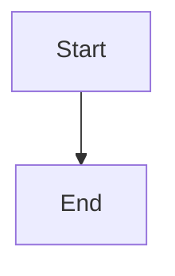

<h1 align=center>Hugo Theme Spoon</h1>

<h4 align=center>🌈 Clean | ⏩ Fast | 📰 Focus on Reading | 🌐 Multi-language | 🌙 Dark Mode | 📱 Mobile-first</h4>

<p align="center">A modern, fast, and clean Hugo theme focused on reading experience. Built with Dart Sass, supporting dark mode, multi-language, KaTeX math, Mermaid diagrams, and more.</p>

<p align="center">English | <a href="README.zh.md">简体中文</a></p>

<p align="center">
  <a href="https://hugo-theme-spoon.vercel.app/">Live Demo</a> ·
  <a href="docs/quick-start.md">Quick Start</a> ·
  <a href="docs/configurations.md">Configuration</a>
</p>

> **Note:** This theme is forked from [hugo-theme-ladder](https://github.com/guangzhengli/hugo-theme-ladder) by [guangzhengli](https://github.com/guangzhengli), and has been heavily modified, adapted, and extended with new features to support the latest Hugo versions and modern web standards. The original theme is no longer actively maintained.

---

<p align="center">
  
</p>

---

## Reading and code previews

Spoon keeps long-form articles readable while giving technical content first-class treatment. Code blocks support filenames, language labels, copy actions, original line numbers, focused lines, and separate light/dark palettes.

<table>
  <tr>
    <td align="center"><strong>Light mode</strong></td>
    <td align="center"><strong>Dark mode</strong></td>
  </tr>
  <tr>
    <td></td>
    <td></td>
  </tr>
</table>

---

## What's Changed from Ladder

| | hugo-theme-ladder | hugo-theme-spoon |
|---|---|---|
| Hugo Version | v0.99.0 | **v0.140.0+ extended** |
| SCSS Transpiler | libsass (deprecated) | **Dart Sass** |
| Dark Mode | Basic | **Two themes + comprehensive coverage** |
| Math Formulas | - | **KaTeX support** |
| Flowcharts | - | **Mermaid support** |
| TOC | Static | **Wide-screen left companion + active section** |
| Code Block | Basic | **Filename, line focus, source snippets, copy action** |
| Reading Progress | - | **Progress bar** |
| Image Loading | Eager | **Lazy loading** |
| Related Posts | - | **Auto recommendations** |
| i18n | Partial | **Full i18n with more keys** |
| Code Highlight | highlight.js | **Hugo Chroma, filename headers, copy button, line focus, and source snippets** |

## Features

- **Fast & Lightweight** — Minimal CSS/JS, optimized for performance
- **Clean Design** — Focused on reading experience with beautiful typography
- **Dark Mode** — Two built-in dark themes (Standard Dark & Icy Dark) with smooth toggle
- **Multi-language** — Built-in i18n support (English, Chinese, Ukrainian, Portuguese)
- **Responsive** — Mobile-first design, works on all devices
- **Dart Sass** — Modern SCSS toolchain, no deprecated libsass dependency
- **Code Highlight** — Hugo Chroma with theme-aware palettes, filenames, line numbers, focused lines, and one-click copy
- **Source Snippets** — Render maintained ranges from real repository files with the `code-file` shortcode
- **Table of Contents** — Active-section navigation in the left desktop gutter, collapsible inline navigation on narrower screens
- **KaTeX Math** — Beautiful math formula rendering (opt-in per page)
- **Mermaid Diagrams** — Flowcharts with auto light/dark theme switching
- **Reading Progress** — Visual progress bar on article pages
- **Lazy Loading** — Automatic image lazy loading for better performance
- **Related Posts** — Automatic related article recommendations
- **Comment System** — Support for Giscus and Utterances
- **Analytics** — Google Analytics and Umami support
- **RSS Feed** — Built-in RSS subscription support
- **Custom Fonts** — LXGW WenKai font for beautiful CJK rendering

## Quick Start

### Prerequisites

- Hugo **v0.140.0+ extended** (requires Dart Sass support)
- Dart Sass (`brew install sass/sass/sass` on macOS)

### Installation

1. Create a new Hugo site:

```bash
hugo new site myblog
cd myblog
```

2. Add the theme:

```bash
git clone https://github.com/noneback/hugo-theme-spoon themes/hugo-theme-spoon
```

3. Configure your site (`config.yml`):

```yaml
baseURL: 'https://your-site.com'
title: My Blog
theme: hugo-theme-spoon
defaultContentLanguage: 'en'
pagination:
  pagerSize: 10

params:
  brand: HOME
  avatarURL: /images/avatar.png
  author: Your Name
  authorDescription: Your description
  info: Your blog info
  favicon: /images/avatar.ico
  darkModeTheme: data-dark-mode # or icy-dark-mode
  options:
    showDarkMode: true
    enableImgZooming: true
    enableMultiLang: true
    showMetaTags: true
```

4. Start the server:

```bash
hugo server -D
```

Open http://localhost:1313/ in your browser.

Create list pages as Hugo sections. For example, use `content/blog/_index.md` rather than `content/blog.md`; otherwise Hugo treats the landing page as a regular article instead of using the blog list template.

### Per-article controls

The reading experience can be adjusted in front matter:

```yaml
toc: false
related: false
comments: false
readingProgress: false
imageZoom: false
```

On wide screens, enabled table-of-contents navigation sits in the left gutter beside the article without reducing the reading column, and highlights the current section.

## Usage

### Code blocks

Add an optional filename, line numbers, and focused lines using Hugo's native code-fence attributes:

````md
```go {title="internal/server/config.go",linenos=table,hl_lines=[2,"4-6"]}
func LoadConfig() error {
    return nil
}
```
````

To keep an article synchronized with code in the same repository, render a selected source range with its original line numbers:

```md

```

### Math Formulas

Add `math: true` to your page front matter:

```yaml
---
title: "My Math Article"
math: true
---
```

### Mermaid Diagrams

Add `mermaid: true` to your page front matter:

```yaml
---
title: "My Flowchart"
mermaid: true
---
```

Then use standard Mermaid syntax in code blocks:

````

````

### Multi-language

Configure languages in `config.yml`:

```yaml
languages:
  en:
    label: English
    menu:
      main:
        - name: Blog
          url: /blog
          weight: 1
  zh:
    label: 中文
    params:
      author: 你的名字
      guestbook:
        title: 留言板
    menu:
      main:
        - name: 文章
          url: /blog
          weight: 1
```

### Comment System

Supports Giscus (recommended) and Utterances. Configure in `params.comments`:

```yaml
params:
  comments:
    giscus:
      enable: true
      repo: username/repo
      repo_id: R_xxx
      category: Announcements
      category_id: DIC_xxx
      mapping: pathname
      lang: en
```

## Documentation

See the [`docs`](docs/home.md) folder for detailed documentation:

- [Quick Start](docs/quick-start.md)
- [Configurations](docs/configurations.md)
- [Multi Language](docs/multi-language.md)
- [Comment System](docs/comment-system.md)
- [Analytics](docs/analytics.md)

## License

[MIT](LICENSE)

## Credits

- Originally forked from [hugo-theme-ladder](https://github.com/guangzhengli/hugo-theme-ladder) by [guangzhengli](https://github.com/guangzhengli) — thanks for the beautiful design and great foundation to build upon.
- Inspired by [hugo-PaperMod](https://github.com/adityatelange/hugo-PaperMod)
- Font: [LXGW WenKai](https://github.com/lxgw/LxgwWenKai)
