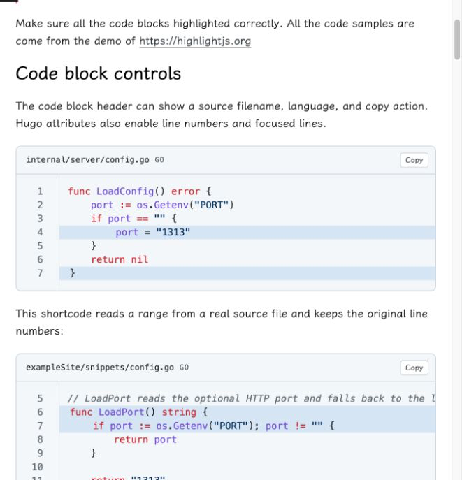
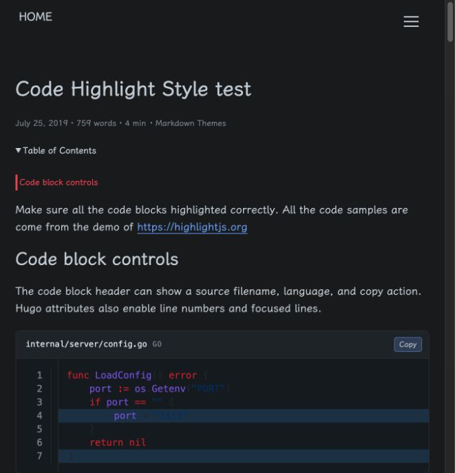
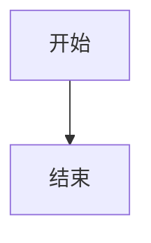

<h1 align=center>Spoon</h1>

<h4 align=center>🌈 简洁 | ⏩ 快速 | 📰 聚焦阅读 | 🌐 多语言 | 🌙 暗色模式 | 📱 移动优先</h4>

<p align="center">一个现代、快速、简洁的 Hugo 主题，专注于阅读体验。使用 Dart Sass 构建，支持暗色模式、多语言、KaTeX 数学公式、Mermaid 流程图等特性。</p>

<p align="center"><a href="README.md">English</a> | 简体中文</p>

<p align="center">
  <a href="https://hugo-theme-spoon.vercel.app/">在线预览</a> ·
  <a href="docs/quick-start.md">快速开始</a> ·
  <a href="docs/configurations.md">配置说明</a>
</p>

> **说明：** 本主题 fork 自 [hugo-theme-ladder](https://github.com/guangzhengli/hugo-theme-ladder) by [guangzhengli](https://github.com/guangzhengli)，并进行了大量修改、适配和功能扩展，以支持最新版本的 Hugo 和现代 Web 标准。原主题已不再活跃维护。

---

<p align="center">
  
</p>

---

## 阅读与代码展示

Spoon 在保持长文阅读舒适度的同时，为技术内容提供完整的代码展示能力：文件名、语言类型、复制操作、原始行号、重点行，以及独立的浅色和深色配色。

<table>
  <tr>
    <td align="center"><strong>浅色模式</strong></td>
    <td align="center"><strong>深色模式</strong></td>
  </tr>
  <tr>
    <td></td>
    <td></td>
  </tr>
</table>

---

## 相比 Ladder 的变化

| | hugo-theme-ladder | hugo-theme-spoon |
|---|---|---|
| Hugo 版本 | v0.99.0 | **v0.140.0+ extended** |
| SCSS 转译器 | libsass (已废弃) | **Dart Sass** |
| 暗色模式 | 基础 | **两套主题 + 全面覆盖** |
| 数学公式 | - | **KaTeX 支持** |
| 流程图 | - | **Mermaid 支持** |
| 目录 | 静态 | **宽屏左侧目录 + 当前章节高亮** |
| 代码块 | 基础 | **文件名、重点行、源码引用、复制操作** |
| 阅读进度 | - | **进度条** |
| 图片加载 | 即时 | **懒加载** |
| 相关文章 | - | **自动推荐** |
| 国际化 | 部分 | **完整 i18n 支持** |
| 代码高亮 | highlight.js | **Hugo Chroma + 浅色/深色配色** |

## 特性

- **快速轻量** — 最小化 CSS/JS，性能优先
- **简洁设计** — 专注于阅读体验，精美排版
- **暗色模式** — 内置两套暗色主题（标准暗色 & 冰蓝暗色），平滑切换
- **多语言支持** — 内置国际化（英语、中文、乌克兰语、葡萄牙语）
- **响应式设计** — 移动优先，适配所有设备
- **Dart Sass** — 现代 SCSS 工具链，无废弃依赖
- **代码高亮** — Hugo Chroma 语法高亮，支持主题配色、文件名、行号、重点行和一键复制
- **源码片段** — 使用 `code-file` shortcode 从仓库真实文件中截取并展示指定范围
- **目录导航** — 宽屏左侧显示并自动高亮当前章节，窄屏回到正文前并支持折叠
- **KaTeX 数学公式** — 优美的公式渲染（按页启用）
- **Mermaid 流程图** — 图表渲染支持（按页启用）
- **阅读进度条** — 文章页面顶部可视化进度显示
- **图片懒加载** — 自动延迟加载图片，提升性能
- **相关文章推荐** — 自动推荐相关内容
- **评论系统** — 支持 Giscus 和 Utterances
- **网站分析** — 支持 Google Analytics 和 Umami
- **RSS 订阅** — 内置 RSS 支持
- **自定义字体** — 使用霞鹜文楷，优美中文排版

## 快速开始

### 前置要求

- Hugo **v0.140.0+ extended**（需要 Dart Sass 支持）
- Dart Sass（macOS: `brew install sass/sass/sass`）

### 安装

1. 创建新的 Hugo 站点：

```bash
hugo new site myblog
cd myblog
```

2. 添加主题：

```bash
git clone https://github.com/noneback/hugo-theme-spoon themes/hugo-theme-spoon
```

3. 配置站点（`config.yml`）：

```yaml
baseURL: 'https://your-site.com'
title: 我的博客
theme: hugo-theme-spoon
defaultContentLanguage: 'zh'
pagination:
  pagerSize: 10

params:
  brand: 首页
  avatarURL: /images/avatar.png
  author: 你的名字
  authorDescription: 你的简介
  info: 你的博客信息
  favicon: /images/avatar.ico
  darkModeTheme: data-dark-mode # 或 icy-dark-mode
  options:
    showDarkMode: true
    enableImgZooming: true
    enableMultiLang: true
    showMetaTags: true
```

4. 启动服务器：

```bash
hugo server -D
```

在浏览器中打开 http://localhost:1313/

列表页必须使用 Hugo section 结构。例如应创建 `content/blog/_index.md`，不要创建 `content/blog.md`；后者会被 Hugo 当成普通文章，无法使用博客列表模板。

### 文章级显示控制

可以在文章 front matter 中按需关闭阅读功能：

```yaml
toc: false
related: false
comments: false
readingProgress: false
imageZoom: false
```

宽屏下，启用目录后会显示在正文左侧的空白区域，不压缩正文阅读宽度，并自动高亮当前阅读章节。

## 使用方法

### 代码块

使用 Hugo 原生代码围栏属性添加文件名、行号和重点行：

````md
```go {title="internal/server/config.go",linenos=table,hl_lines=[2,"4-6"]}
func LoadConfig() error {
    return nil
}
```
````

如果希望文章始终引用仓库中的真实代码，可以截取文件范围并保留原始行号：

```md

```

### 数学公式

在页面 front matter 中添加 `math: true`：

```yaml
---
title: "我的数学文章"
math: true
---
```

### Mermaid 流程图

在页面 front matter 中添加 `mermaid: true`：

```yaml
---
title: "我的流程图"
mermaid: true
---
```

然后在代码块中使用标准 Mermaid 语法：

````

````

### 多语言配置

在 `config.yml` 中配置语言：

```yaml
languages:
  zh:
    label: 中文
    params:
      author: 你的名字
      guestbook:
        title: 留言板
    menu:
      main:
        - name: 文章
          url: /blog
          weight: 1
        - name: 标签
          url: /tags
          weight: 2
        - name: 归档
          url: /archives
          weight: 3
  en:
    label: English
    menu:
      main:
        - name: Blog
          url: /blog
          weight: 1
        - name: Tags
          url: /tags
          weight: 2
        - name: Archive
          url: /archives
          weight: 3
```

### 评论系统

支持 Giscus（推荐）和 Utterances，在 `params.comments` 中配置：

```yaml
params:
  comments:
    giscus:
      enable: true
      repo: username/repo
      repo_id: R_xxx
      category: Announcements
      category_id: DIC_xxx
      mapping: pathname
      lang: zh
```

## 文档

详见 [`docs`](docs/home.md) 文件夹：

- [快速开始](docs/quick-start.md)
- [配置说明](docs/configurations.md)
- [多语言](docs/multi-language.md)
- [评论系统](docs/comment-system.md)
- [网站分析](docs/analytics.md)

## 许可证

[MIT](LICENSE)

## 致谢

- 最初 fork 自 [hugo-theme-ladder](https://github.com/guangzhengli/hugo-theme-ladder) by [guangzhengli](https://github.com/guangzhengli) — 感谢原作者提供优秀的设计基础。
- 灵感来自 [hugo-PaperMod](https://github.com/adityatelange/hugo-PaperMod)
- 字体：[霞鹜文楷 LXGW WenKai](https://github.com/lxgw/LxgwWenKai)
