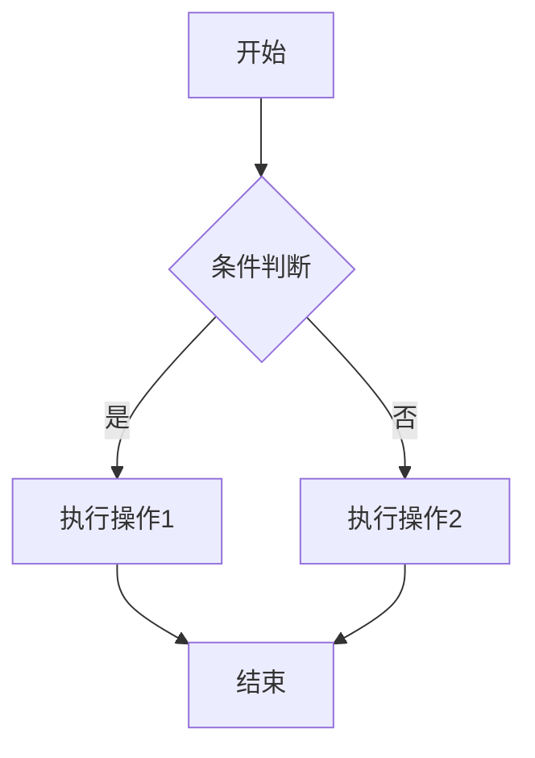
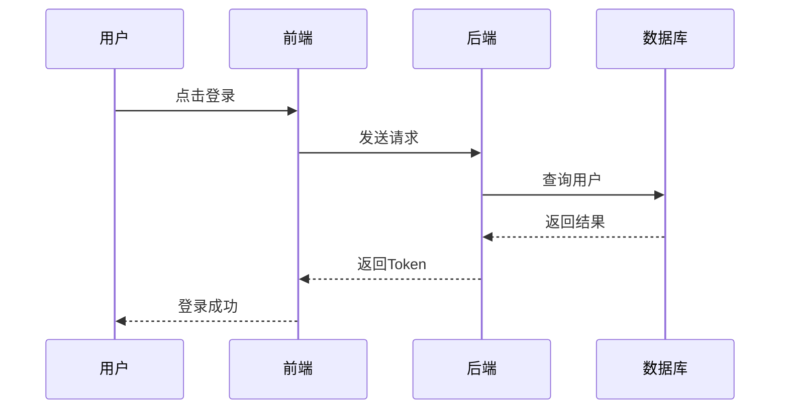
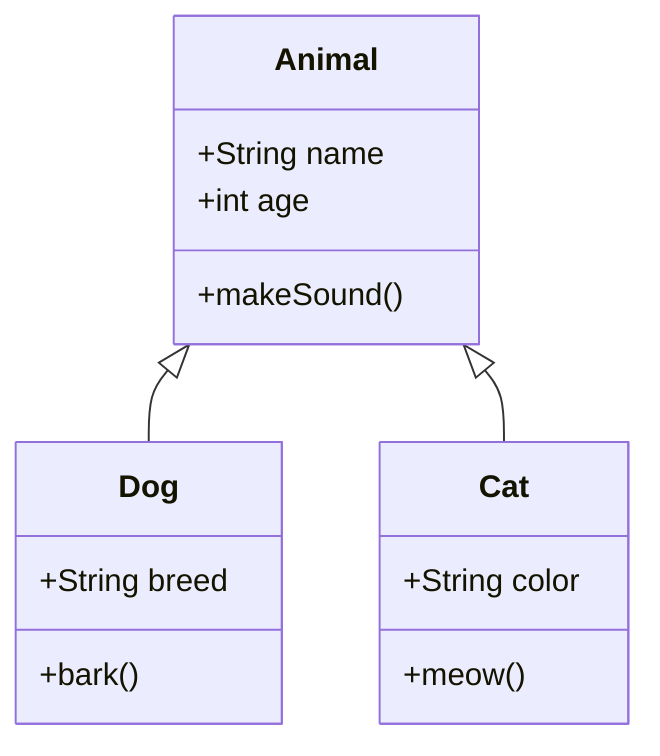
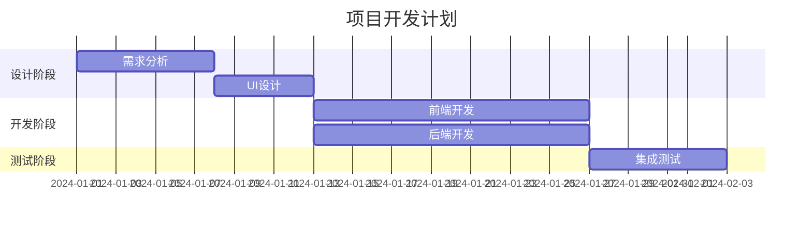

这篇文章测试数学公式和流程图的渲染功能。

<!--more-->

## 数学公式 (KaTeX)

### 行内公式

质能方程 $E = mc^2$ 是物理学中最著名的公式之一。

欧拉公式 $e^{i\pi} + 1 = 0$ 将五个最重要的数学常数联系在一起。

### 块级公式

高斯积分：

$$
\int_{-\infty}^{\infty} e^{-x^2} dx = \sqrt{\pi}
$$

麦克斯韦方程组（微分形式）：

$$
\nabla \cdot \mathbf{E} = \frac{\rho}{\varepsilon_0}
$$

$$
\nabla \cdot \mathbf{B} = 0
$$

$$
\nabla \times \mathbf{E} = -\frac{\partial \mathbf{B}}{\partial t}
$$

$$
\nabla \times \mathbf{B} = \mu_0\mathbf{J} + \mu_0\varepsilon_0\frac{\partial \mathbf{E}}{\partial t}
$$

矩阵表示：

$$
\begin{pmatrix}
a_{11} & a_{12} & a_{13} \\
a_{21} & a_{22} & a_{23} \\
a_{31} & a_{32} & a_{33}
\end{pmatrix}
$$

## 流程图 (Mermaid)

### 基本流程图



### 序列图



### 类图



### 甘特图



## 代码示例

```python
def fibonacci(n: int) -> int:
    """计算斐波那契数列第n项"""
    if n <= 1:
        return n
    a, b = 0, 1
    for _ in range(2, n + 1):
        a, b = b, a + b
    return b
```
